# [Senior Skip Day](http://seniorskip.com)

## Table of Contents

1. [About](#about)
2. [Procedure](#procedure)
3. [Tools](#tools)
5. [Data Source](#data-source)
6. [Features](#features)
7. [Target Variable Selection](#target-variable-selection)
8. [Model Selection](Model Selection)
9. [Evaluation](Evaluation)
10. [Web Application](#web-application)
11. [Contact](questions-reach-out)

## About
**[Seniorskip.com](http://seniorskip.com/) is a early warning notification system built for Transparent Classroom. A dashboard prioritizing the time of customer service representatives.**

[Seniorskip.com](http://seniorskip.com/) is churn with a twist. Transparent Classroom makes student tracking software for teachers, and they have a problem. Sometimes teachers take vacation, and sometimes they decide to drop the software. The only catch is, they don’t change their account. The school does. So the account doesn’t churn, but activity does.

Data-wise these two conditions look similar. In the vacation case it would be very annoying for the teachers to get an email or text asking why they left the service. In the drop case you want to intervene as soon as possible.

Tricky.

Solution: make an early warning notification system and dashboard.

http://seniorskip.com/ - (Image data hidden for client)

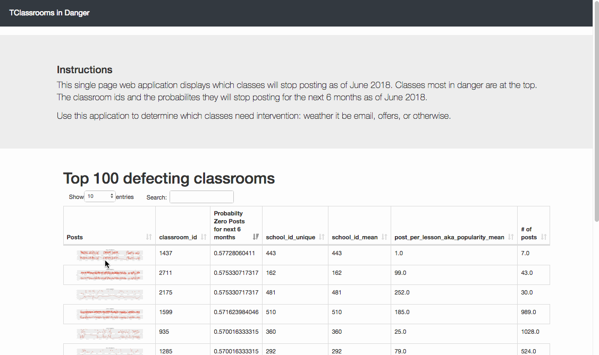

## Procedure
1. EDA to assess proper prediction methodology
2. Feature extraction from Transparent Classroom data.
3. Train/Test split and model.
4. Create dashboard on Flask web application at (seniorskip.com)[http://seniorskip.com/]

## Tools

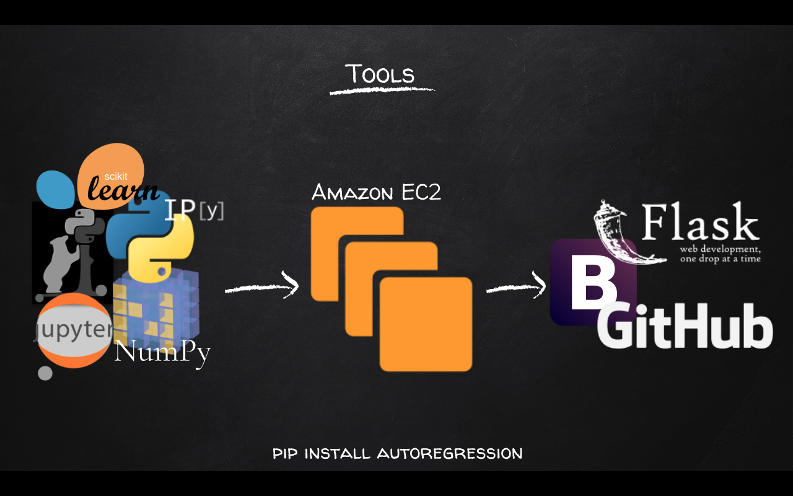
 - autoregression
 - Scikit Learn
 - Pandas
 - Jupyter Notebook
 - NumPy
 - EC2
 - Flask
 - Bootstrap
 - Javascript

## Data Source

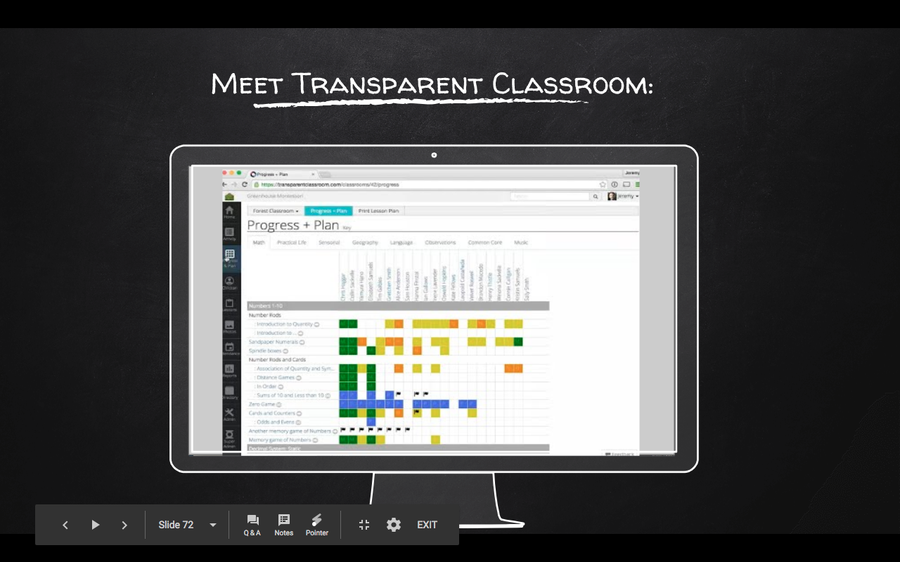

Transparent classroom’s database. Actual Data not available to the public, sorry. It's a series of tables, detailing posts, teachers, classrooms, lessons, and their relationship.

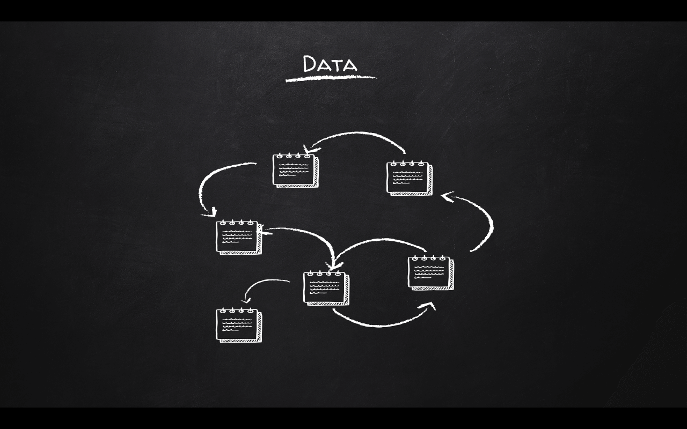

## Features

I extracted these features from the table relationships:

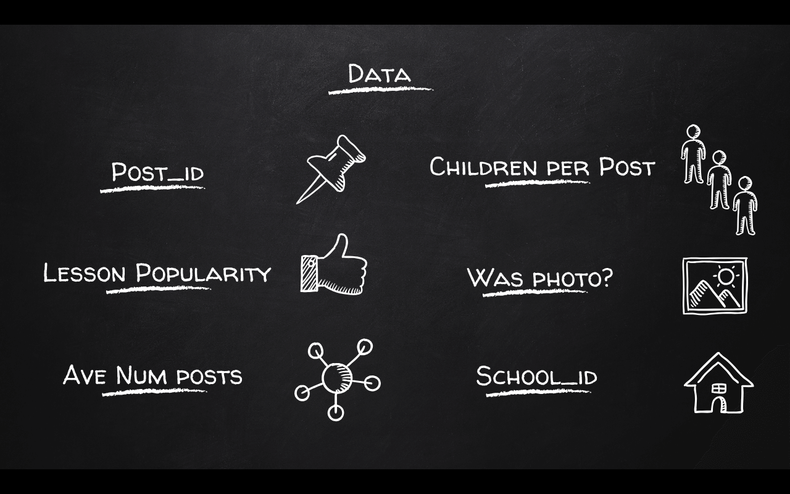

## Target Variable Selection

There are only 30 users who’ve left the company. So churn isn’t the correct measurement in this case. Schools discontinue their accounts at the one year mark. Teachers don’t have a direct say. The product owner theorized that non-use is related to discontinuing accounts.

Upon EDA, the data looks continuously distributed. But looking at the log(posts) number, we can see that there is two distinct classes. This allows for binary classification for a first pass.

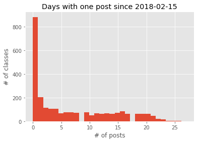
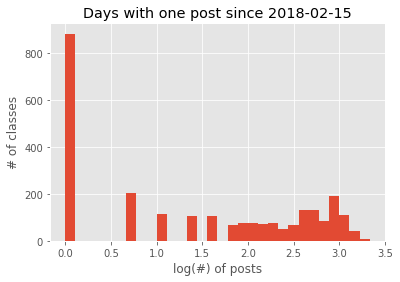
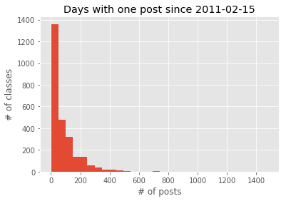
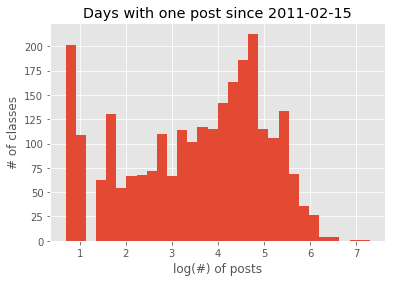
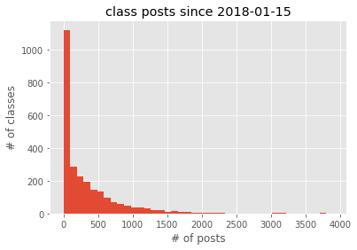
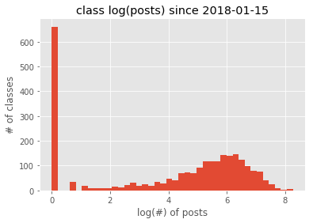
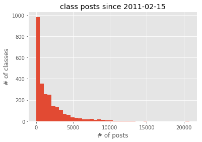
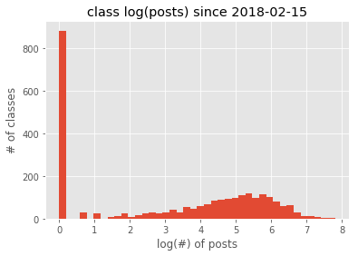

## Model Selection

## Evaluation

## Web Application
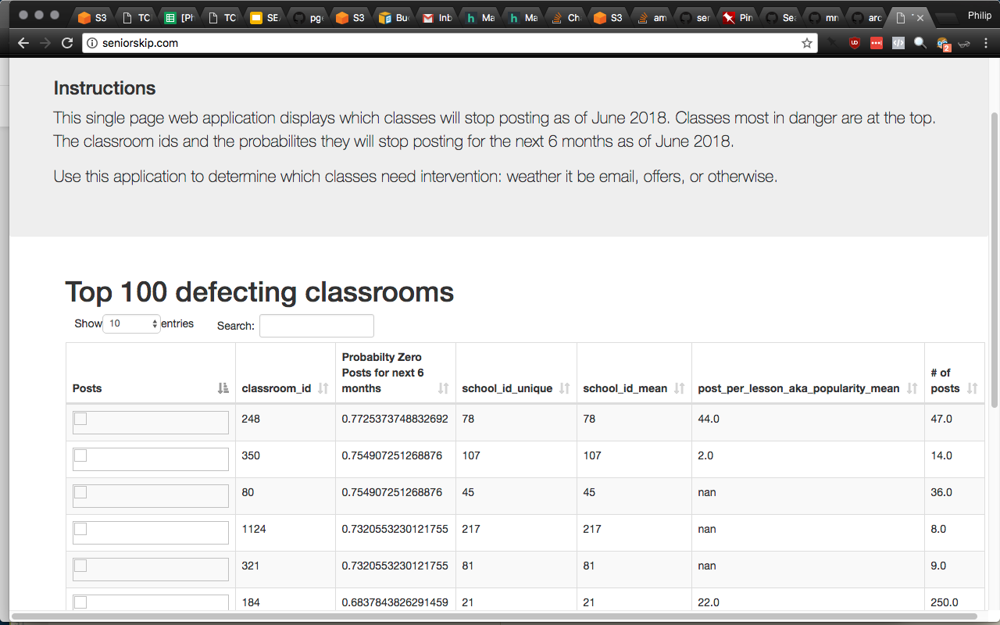

The application returns:
  * table sortable by any column (including probability of making zero posts in three months)
  * sparklines and information according to each classroom.

## Questions? Reach out!

