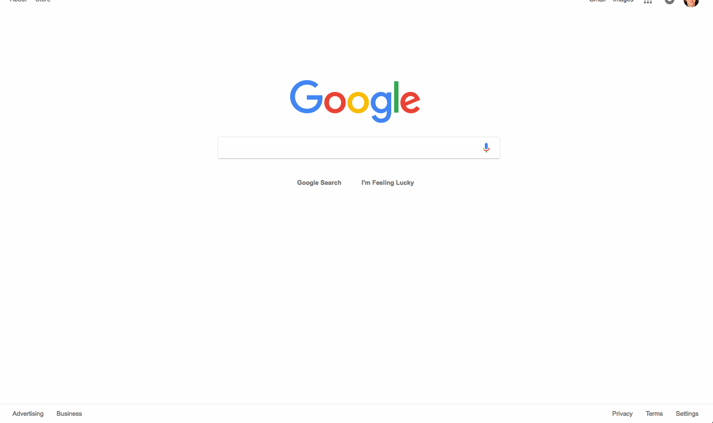

# Notification for User churn in Transparent Classroom

Clear research question:
What are the inferential relationships between user interaction and eventual cutoff. Can we warn them to get them back on track?

###

### Data source:

Transparent classroom’s last one year database.

### Analytics base table conversion:

They’ve put it into a csv, with each action taken, school, classroom, teacher, ect. Client isn’t willing to give full access.

### Model:

This one is trickier. I honestly plan on comparing methods using a program I’ve already written.
I haven’t learned time series methods yet. I’m hoping to learn something quite imminently. If not I want to see current use effects use three months from now.

### How evaluate?

There are only 30 users who’ve left the company. So churn isn’t the correct measurement in this case. Schools discontinue their accounts (one year long). But teachers don’t have a direct say. Teacher decreased use is theorized to be related to decrease of use. Instead we’ll be using the their pre-set metric “health score” which is a amalgamation of five metrics (given in code)
We’ll see how many stopped meeting this score.

### What is the MVP?

A python model that gives a prediction if the users will stop using the service soon (and how permanently?)

### Causal Inference:
Yes, this is a risk as we don’t have time to make a test just yet. The client is OK with this.

An assistive goal would be to compare the use dropoff with the 30 churns results to decide which method is best:

These are the subscription renewals:

